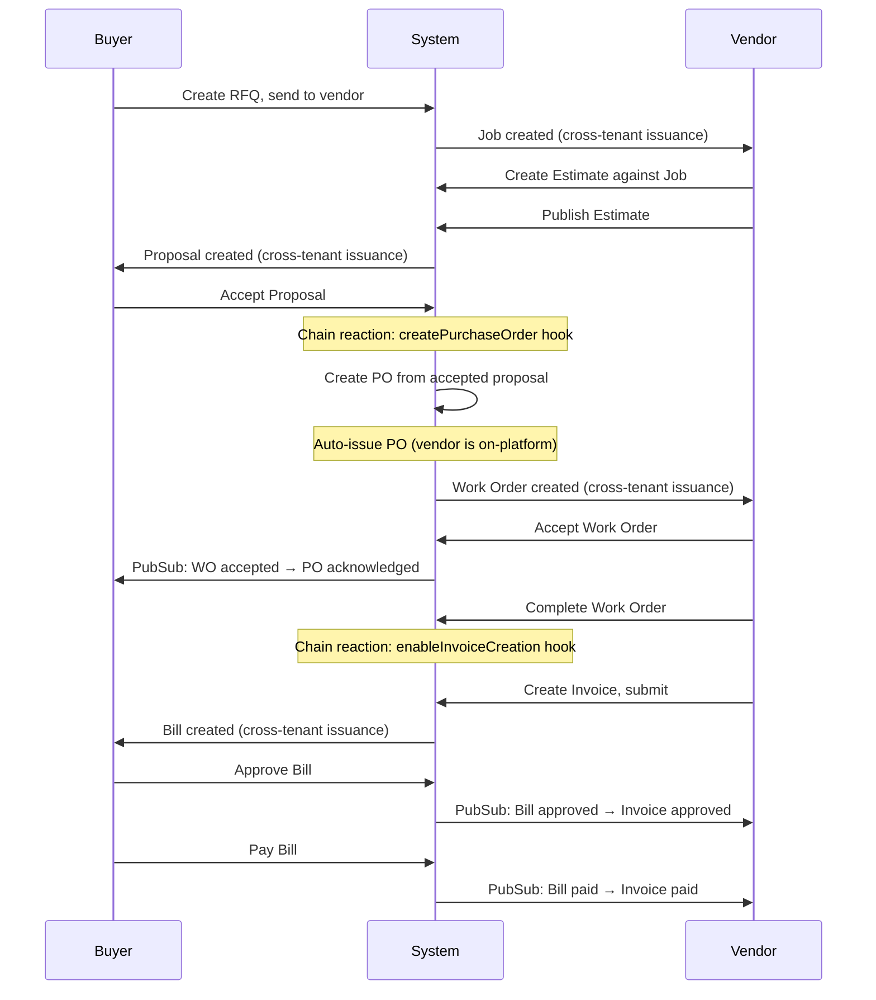

# 48d — Supply Chain Reactions & Event-Driven Pipeline

**Series:** 48 (Cross-Tenant Supply Chain Completion)  
**Review reference:** `docs/reviews/cross-tenant-supply-chain-review.md` items #2, #8, #10  
**Depends on:** 48 (workflow engine), 48b (RFQ→Job), 48c (Invoice/Bill)  
**Status:** Planned

---

## Overview

With the individual document pairs wired (PO→WO, Quote→Proposal, RFQ→Job, Invoice→Bill), this document addresses the **automated reactions** that chain them together into a complete supply chain, and the **pub/sub infrastructure gaps** that prevent cross-tenant events from flowing end-to-end.

Three concerns:

1. **Chain reactions** — accepting a proposal should automatically create a PO; completing a WO should enable invoice creation. These are workflow hooks that fire on specific transitions.
2. **Pub/sub topic coverage** — `quote`, `proposal`, `rfq`, and `job` are missing from the topic resolver, so `PublishCrossTenantEventHook` enqueues events that the publisher marks as failed.
3. **Transactional outbox hardening** — the publisher has no retry logic for failed rows, no dead-letter handling, and `maxAttempts` / `notBefore` are unused.

---

## Chain Reaction Hooks

### `CreatePurchaseOrderHook`

**Fires on:** proposal `accepted` transition  
**Purpose:** When the buyer accepts a proposal, automatically create a PO in the buyer's tenant and (if the vendor is on-platform) issue it to create a WO.

**New file:** `apps/api/src/modules/domain/workflows/hooks/create-purchase-order.hook.ts`

```typescript
import { Injectable, Logger } from '@nestjs/common';
import { eq } from 'drizzle-orm';
import type { OnEnterHook, WorkflowContext } from '../workflow.interface';
import { purchaseOrders, proposals, quotes, vendors } from '../../../../database/schema';
import { LookupResolutionService } from '../../services/lookup-resolution.service';
import { WorkflowEngineService } from '../workflow-engine.service';
import { LOOKUP_DOMAINS } from '../../constants/lookup-domains';

@Injectable()
export class CreatePurchaseOrderHook implements OnEnterHook {
  name = 'createPurchaseOrder';
  private readonly logger = new Logger('CreatePurchaseOrderHook');

  constructor(
    private readonly lookupResolution: LookupResolutionService,
    private readonly workflowEngine: WorkflowEngineService,
  ) {}

  async execute(context: WorkflowContext): Promise<void> {
    if (context.entityType !== 'proposal') return;

    const logPrefix = 'CreatePurchaseOrderHook.execute';
    const tx = context.tx;
    const buyerTenantId = context.tenantId;

    // Load the proposal with its source quote/RFQ reference
    const [proposal] = await tx
      .select()
      .from(proposals)
      .where(eq(proposals.id, context.entityId));

    if (!proposal) {
      this.logger.warn(`${logPrefix} — proposal ${context.entityId} not found`);
      return;
    }

    // The proposal's sourceOrganisationId is the vendor (quote issuer)
    const vendorOrganisationId = proposal.sourceOrganisationId;
    if (!vendorOrganisationId) {
      this.logger.debug(
        `${logPrefix} — proposal ${context.entityId} has no sourceOrganisationId, skipping PO creation`,
      );
      return;
    }

    // Resolve PO status
    const draftStatusId = await this.lookupResolution.resolve({
      tenantId: buyerTenantId,
      domain: LOOKUP_DOMAINS.PURCHASE_ORDER_STATUS,
      externalReference: 'Draft',
      name: 'Draft',
      autoCreate: true,
      tx,
    });

    // Resolve vendor in buyer's tenant
    const [vendor] = await tx
      .select()
      .from(vendors)
      .where(eq(vendors.organisationId, vendorOrganisationId))
      .limit(1);

    // Create PO in buyer's tenant
    const [po] = await tx
      .insert(purchaseOrders)
      .values({
        tenantId: buyerTenantId,
        claimId: proposal.claimId,
        jobId: proposal.jobId,
        vendorId: vendor?.id ?? null,
        proposalId: proposal.id,
        name: `PO from accepted proposal ${proposal.proposalNumber ?? proposal.id}`,
        statusLookupId: draftStatusId,
        recipientOrganisationId: vendorOrganisationId,
        createdByUserId: context.userId,
      })
      .returning();

    // Initialize PO workflow at draft
    await this.workflowEngine.initializeState({
      tenantId: buyerTenantId,
      entityType: 'purchase_order',
      entityId: po.id,
      workflowName: 'standard',
      initialStep: 'draft',
      userId: context.userId,
      tx,
    });

    this.logger.log(
      `${logPrefix} — created PO ${po.id} from accepted proposal ${context.entityId}`,
    );

    // If the vendor org is an active tenant, auto-issue the PO
    // This creates a WO in the vendor's tenant via the existing issueDocument hook
    const [vendorOrg] = await tx
      .select()
      .from(organizations)
      .where(eq(organizations.id, vendorOrganisationId));

    if (vendorOrg?.subscriptionStatus === 'active') {
      this.logger.log(
        `${logPrefix} — vendor ${vendorOrganisationId} is active, auto-issuing PO ${po.id}`,
      );

      // Advance PO through draft → pending_approval → approved → issued
      // in a single transaction, since this is an automated chain reaction
      await this.workflowEngine.advance({
        tenantId: buyerTenantId,
        entityType: 'purchase_order',
        entityId: po.id,
        workflowName: 'standard',
        action: 'submit',
        currentStep: 'draft',
        userId: 'system',
        tx,
      });

      await this.workflowEngine.advance({
        tenantId: buyerTenantId,
        entityType: 'purchase_order',
        entityId: po.id,
        workflowName: 'standard',
        action: 'approve',
        currentStep: 'pending_approval',
        userId: 'system',
        tx,
      });

      await this.workflowEngine.advance({
        tenantId: buyerTenantId,
        entityType: 'purchase_order',
        entityId: po.id,
        workflowName: 'standard',
        action: 'issue',
        currentStep: 'approved',
        userId: 'system',
        tx,
      });
      // The 'issue' transition has onEnter: ['issueDocument', 'publishCrossTenantEvent']
      // which creates the WO in vendor's tenant
    }
  }
}
```

### `EnableInvoiceCreationHook`

**Fires on:** work order `completed` transition  
**Purpose:** When a vendor marks a WO as completed, set a flag and optionally create a draft invoice template.

**New file:** `apps/api/src/modules/domain/workflows/hooks/enable-invoice-creation.hook.ts`

```typescript
import { Injectable, Logger } from '@nestjs/common';
import { eq } from 'drizzle-orm';
import type { OnEnterHook, WorkflowContext } from '../workflow.interface';
import { workOrders } from '../../../../database/schema';

@Injectable()
export class EnableInvoiceCreationHook implements OnEnterHook {
  name = 'enableInvoiceCreation';
  private readonly logger = new Logger('EnableInvoiceCreationHook');

  async execute(context: WorkflowContext): Promise<void> {
    if (context.entityType !== 'work_order') return;

    const logPrefix = 'EnableInvoiceCreationHook.execute';
    const tx = context.tx;

    // Set a flag in workOrderPayload indicating invoice can be created
    const [wo] = await tx
      .select()
      .from(workOrders)
      .where(eq(workOrders.id, context.entityId));

    if (!wo) return;

    const payload = (wo.workOrderPayload as Record<string, unknown>) ?? {};
    payload.invoiceEnabled = true;
    payload.completedAt = new Date().toISOString();

    await tx
      .update(workOrders)
      .set({
        workOrderPayload: payload,
        updatedAt: new Date(),
      })
      .where(eq(workOrders.id, context.entityId));

    this.logger.log(
      `${logPrefix} — enabled invoice creation for WO ${context.entityId}`,
    );

    // Future: create a draft invoice template pre-populated from WO line items
    // Future: send notification to vendor that WO is complete and they can invoice
  }
}
```

### Registration

**File:** `apps/api/src/modules/domain/workflows/workflow.module.ts`

```typescript
import { CreatePurchaseOrderHook } from './hooks/create-purchase-order.hook';
import { EnableInvoiceCreationHook } from './hooks/enable-invoice-creation.hook';

// In providers:
CreatePurchaseOrderHook,
EnableInvoiceCreationHook,

// In onModuleInit():
this.engine.registerHook(this.createPurchaseOrderHook);
this.engine.registerHook(this.enableInvoiceCreationHook);
```

---

## Updated Workflow Definitions

### Proposal — add `createPurchaseOrder` to `accepted` transition

**File:** `apps/api/src/modules/domain/workflows/definitions/proposal.workflows.ts`

Current `accepted` transitions have `onEnter: ['publishCrossTenantEvent']`. Update to include `syncStatusLookup` (from doc 48) and `createPurchaseOrder`:

```typescript
{
  id: 'received',
  label: 'Received',
  transitions: [
    { to: 'under_review', action: 'review', onEnter: ['syncStatusLookup'] },
    {
      to: 'accepted',
      action: 'accept',
      onEnter: ['syncStatusLookup', 'publishCrossTenantEvent', 'createPurchaseOrder'],
    },
    {
      to: 'declined',
      action: 'decline',
      onEnter: ['syncStatusLookup', 'publishCrossTenantEvent'],
    },
  ],
},
{
  id: 'under_review',
  label: 'Under Review',
  transitions: [
    {
      to: 'accepted',
      action: 'accept',
      onEnter: ['syncStatusLookup', 'publishCrossTenantEvent', 'createPurchaseOrder'],
    },
    {
      to: 'declined',
      action: 'decline',
      onEnter: ['syncStatusLookup', 'publishCrossTenantEvent'],
    },
  ],
},
```

### Work Order — add `enableInvoiceCreation` to `completed` transition

**File:** `apps/api/src/modules/domain/workflows/definitions/work-order.workflows.ts`

On the `completed` step's `onEnter`:

```typescript
{
  to: 'completed',
  action: 'complete',
  onEnter: ['syncStatusLookup', 'publishCrossTenantEvent', 'enableInvoiceCreation'],
},
```

---

## Pub/Sub Topic Coverage

### Problem

`resolveTopicForEntity()` in `topic-resolver.ts` currently maps only: `purchase_order`, `work_order`, `organisation`, `invoice`, `bill`. Missing entities: `quote`, `proposal`, `rfq`, `job`.

When `PublishCrossTenantEventHook` enqueues an event for a `quote` or `proposal` entity, the `PubSubPublisherService` calls `resolveTopicForEntity('proposal')` → returns `null` → marks the row as `failed` with a warning.

### Fix

**File:** `apps/api/src/config/pubsub.config.ts`

Add topics and subscriptions:

```typescript
topics: {
  purchaseOrders: `claims.purchase-orders-${env}`,
  workOrders: `claims.work-orders-${env}`,
  organisations: `claims.organisations-${env}`,
  invoices: `claims.invoices-${env}`,
  bills: `claims.bills-${env}`,
  quotes: `claims.quotes-${env}`,         // NEW
  proposals: `claims.proposals-${env}`,   // NEW
  rfqs: `claims.rfqs-${env}`,             // NEW
  jobs: `claims.jobs-${env}`,             // NEW
},
subscriptions: {
  purchaseOrderEvents: `claims.purchase-orders-api-sub-${env}`,
  workOrderEvents: `claims.work-orders-api-sub-${env}`,
  organisationEvents: `claims.organisations-api-sub-${env}`,
  quoteEvents: `claims.quotes-api-sub-${env}`,       // NEW
  proposalEvents: `claims.proposals-api-sub-${env}`, // NEW
  rfqEvents: `claims.rfqs-api-sub-${env}`,           // NEW
  jobEvents: `claims.jobs-api-sub-${env}`,            // NEW
},
```

**File:** `apps/api/src/modules/pubsub/topic-resolver.ts`

Add to `ENTITY_TO_TOPIC`:

```typescript
const ENTITY_TO_TOPIC: Record<string, PubSubTopicKey> = {
  purchase_order: 'purchaseOrders',
  work_order: 'workOrders',
  organisation: 'organisations',
  invoice: 'invoices',
  bill: 'bills',
  quote: 'quotes',       // NEW
  proposal: 'proposals',   // NEW
  rfq: 'rfqs',             // NEW
  job: 'jobs',             // NEW
};
```

### New event handlers

**`QuoteEventHandler`** — `apps/api/src/modules/pubsub/handlers/quote-event.handler.ts`

Handles cross-tenant events for quotes. When a vendor's quote transitions affect the buyer's proposal:

```typescript
@Injectable()
export class QuoteEventHandler implements PubSubEventHandler {
  readonly entityType = 'quote';
  readonly eventTypes = ['quote.publish', 'quote.revise'];

  async handle(event: DomainEventEnvelope): Promise<void> {
    switch (event.eventType) {
      case 'quote.publish':
        // Quote published → proposal already created via issueDocument hook
        // This event is for notification/audit only
        break;
      case 'quote.revise':
        // Quote revised → update proposal's latestAvailableVersion
        // Set versionAcknowledged = false on the linked proposal
        break;
    }
  }
}
```

**`ProposalEventHandler`** — `apps/api/src/modules/pubsub/handlers/proposal-event.handler.ts`

Handles buyer-side proposal actions that affect the vendor's quote:

```typescript
@Injectable()
export class ProposalEventHandler implements PubSubEventHandler {
  readonly entityType = 'proposal';
  readonly eventTypes = ['proposal.accept', 'proposal.decline'];

  async handle(event: DomainEventEnvelope): Promise<void> {
    switch (event.eventType) {
      case 'proposal.accept':
        // Buyer accepted proposal → notify vendor, update source quote status
        // The vendor's quote moves to an 'accepted' state
        if (event.payload.sourceQuoteId && event.payload.sourceTenantId) {
          await this.workflowEngine.project({
            entityType: 'quote',
            entityId: event.payload.sourceQuoteId,
            tenantId: event.payload.sourceTenantId,
            workflowName: 'standard',
            targetStep: 'accepted',
            userId: 'system',
          });
        }
        break;

      case 'proposal.decline':
        // Buyer declined proposal → vendor's quote can be revised or abandoned
        if (event.payload.sourceQuoteId && event.payload.sourceTenantId) {
          await this.workflowEngine.project({
            entityType: 'quote',
            entityId: event.payload.sourceQuoteId,
            tenantId: event.payload.sourceTenantId,
            workflowName: 'standard',
            targetStep: 'declined',
            userId: 'system',
          });
        }
        break;
    }
  }
}
```

RFQ and Job event handlers are defined in doc 48b. Register all new handlers in `PubSubModule`.

---

## Transactional Outbox Hardening

### Problem

The `PubSubPublisherService` polls every 5 seconds for `pending` rows but:
- **No retry for failed rows:** once marked `failed`, rows stay failed permanently
- **`maxAttempts` is unused:** the column exists but the publisher ignores it
- **`notBefore` is unused:** scheduled delay is not respected
- **No dead-letter handling:** no visibility into permanently failed events
- **No monitoring:** no alerting when events sit unprocessed

### Changes

#### 3.1 — Retry with exponential backoff

**File:** `apps/api/src/modules/pubsub/pubsub-publisher.service.ts`

In the poll query, include failed rows that haven't exceeded `maxAttempts`:

```typescript
// Current: only pending
const rows = await this.db
  .select()
  .from(outboundSyncQueue)
  .where(
    and(
      eq(outboundSyncQueue.channel, 'pubsub'),
      or(
        // Pending rows ready to go
        and(
          eq(outboundSyncQueue.status, 'pending'),
          lte(outboundSyncQueue.scheduledAt, now),
        ),
        // Failed rows eligible for retry
        and(
          eq(outboundSyncQueue.status, 'failed'),
          lt(outboundSyncQueue.attempts, outboundSyncQueue.maxAttempts),
          lte(outboundSyncQueue.scheduledAt, now),
        ),
      ),
    ),
  )
  .orderBy(outboundSyncQueue.priority, outboundSyncQueue.scheduledAt)
  .limit(50);
```

On failure, set `scheduledAt` to an exponential backoff:

```typescript
const backoffMs = Math.min(
  1000 * Math.pow(2, row.attempts),  // 1s, 2s, 4s, 8s, 16s
  60_000,                              // cap at 60s
);
await tx
  .update(outboundSyncQueue)
  .set({
    status: row.attempts + 1 >= row.maxAttempts ? 'dead_letter' : 'failed',
    attempts: row.attempts + 1,
    lastError: error.message,
    lastAttemptedAt: new Date(),
    scheduledAt: new Date(Date.now() + backoffMs),
  })
  .where(eq(outboundSyncQueue.id, row.id));
```

#### 3.2 — Dead-letter status

Add `'dead_letter'` to the status check constraint on `outbound_sync_queue`:

```sql
ALTER TABLE outbound_sync_queue
  DROP CONSTRAINT IF EXISTS outbound_sync_queue_status_check,
  ADD CONSTRAINT outbound_sync_queue_status_check
    CHECK (status IN ('pending', 'processing', 'sent', 'failed', 'cancelled', 'dead_letter'));
```

Dead-letter rows are never re-polled. They remain for visibility and manual investigation.

#### 3.3 — Respect `notBefore`

Add `notBefore` to the poll filter:

```typescript
or(
  isNull(outboundSyncQueue.notBefore),
  lte(outboundSyncQueue.notBefore, now),
),
```

#### 3.4 — Idempotency verification

In the subscriber, before dispatching to handlers, check if the event was already processed:

```typescript
if (envelope.idempotencyKey) {
  const [existing] = await this.db
    .select({ id: outboundSyncQueue.id })
    .from(outboundSyncQueue)
    .where(
      and(
        eq(outboundSyncQueue.idempotencyKey, envelope.idempotencyKey),
        eq(outboundSyncQueue.status, 'sent'),
      ),
    )
    .limit(1);

  if (existing) {
    this.logger.debug(
      `PubSubSubscriberService — skipping duplicate event ${envelope.idempotencyKey}`,
    );
    return;
  }
}
```

#### 3.5 — Monitoring

Add a periodic check (runs every 60 seconds) logging a warning when events have been pending for longer than a configurable SLA:

```typescript
private readonly SLA_MS = 30_000; // 30 seconds

private async checkSla(): Promise<void> {
  const cutoff = new Date(Date.now() - this.SLA_MS);
  const [result] = await this.db
    .select({ count: sql<number>`count(*)` })
    .from(outboundSyncQueue)
    .where(
      and(
        eq(outboundSyncQueue.channel, 'pubsub'),
        eq(outboundSyncQueue.status, 'pending'),
        lte(outboundSyncQueue.scheduledAt, cutoff),
      ),
    );

  if (result.count > 0) {
    this.logger.warn(
      `PubSubPublisherService — ${result.count} pubsub events pending beyond SLA (${this.SLA_MS}ms)`,
    );
  }

  const [deadLetters] = await this.db
    .select({ count: sql<number>`count(*)` })
    .from(outboundSyncQueue)
    .where(
      and(
        eq(outboundSyncQueue.channel, 'pubsub'),
        eq(outboundSyncQueue.status, 'dead_letter'),
      ),
    );

  if (deadLetters.count > 0) {
    this.logger.warn(
      `PubSubPublisherService — ${deadLetters.count} dead-letter events require investigation`,
    );
  }
}
```

---

## Full Supply Chain Flow (End State)

After docs 48–48d are implemented, the complete automated flow looks like:



### Manual (off-platform) flow

For vendors not on the platform, the buyer uses manual capture at each stage:

1. **RFQ:** Send RFQ as PDF/email → vendor responds off-platform
2. **Proposal:** Buyer captures vendor's response via `POST /rfqs/capture` or `POST /quotes/capture`
3. **PO:** Created automatically when proposal is accepted (or manually)
4. **WO:** Not applicable (vendor manages work externally)
5. **Invoice:** Buyer captures vendor invoice via `POST /invoices/capture`
6. **Bill:** Created automatically from captured invoice

Ghost organisations preserve data isolation for future onboarding.

---

## Hook Execution Order

When multiple `onEnter` hooks are registered on a transition, the workflow engine executes them in array order. The correct sequence for proposal `accepted`:

1. **`syncStatusLookup`** — updates `statusLookupId` (idempotent, always runs first)
2. **`publishCrossTenantEvent`** — enqueues event to outbox (in same DB transaction)
3. **`createPurchaseOrder`** — creates PO and potentially auto-issues (in same DB transaction)

All three participate in the same database transaction via `context.tx`. If any hook throws, the entire transition (including lookup update and outbox insert) rolls back.

---

## Testing Strategy

- **Chain reaction (proposal → PO):** Accept a proposal from an on-platform vendor. Verify PO created in buyer tenant. Verify PO auto-issued. Verify WO created in vendor tenant.
- **Chain reaction (WO → invoice enabled):** Complete a WO. Verify `workOrderPayload.invoiceEnabled = true`.
- **Pub/sub coverage:** Publish a quote. Verify event reaches `quotes` topic. Accept a proposal. Verify event reaches `proposals` topic.
- **Retry/backoff:** Simulate a topic publish failure. Verify row transitions to `failed` with backoff `scheduledAt`. Verify re-polling picks it up. After `maxAttempts`, verify `dead_letter` status.
- **Idempotency:** Push the same event twice. Verify handler executes only once.
- **SLA monitoring:** Insert a pending row with old `scheduledAt`. Verify warning logged.

---

## File Impact Summary

| Category | Files |
|----------|-------|
| **New files** | `create-purchase-order.hook.ts`, `enable-invoice-creation.hook.ts`, `quote-event.handler.ts`, `proposal-event.handler.ts` |
| **Modified (backend)** | `proposal.workflows.ts` (add hooks), `work-order.workflows.ts` (add hook), `workflow.module.ts` (register hooks+handlers), `pubsub.config.ts` (4 new topics), `topic-resolver.ts` (4 new mappings), `pubsub-publisher.service.ts` (retry, backoff, SLA), `pubsub-subscriber.service.ts` (idempotency), `pubsub.module.ts` (register handlers) |
| **Migration** | Update `outbound_sync_queue` status check constraint (add `dead_letter`) |
