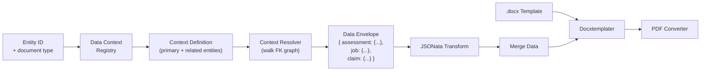
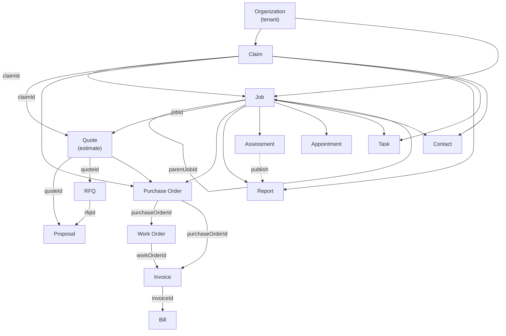

# 56 — Report Builder UX

## Overview

Redesign the reporting subsystem to give template administrators a chat-driven, end-to-end pipeline builder and give end-users a guided print experience with data-scope control. The work introduces four interlocking layers:

1. **Data Context Registry** — declarative entity-relationship graph per document type, replacing hard-coded mapper joins with a traversal-driven resolver.
2. **Data Sources UI** — a third tab on the document-template detail page that visualises and controls which related entities feed into a report.
3. **Report Builder Agent** — a capability-pack chat agent that orchestrates data context, JSONata transform, and DOCX template creation from natural language.
4. **Print Wizard** — an enhanced end-user print drawer with data-scope checkboxes driven by the Data Context Registry.

**Prerequisite docs:** 46 (agentic AI platform), document-template transform layer review (`docs/reviews/document-template-transform-layer.md`).

---

## Current state

### Pipeline

```
PrintButton / workflow hook
  → DocumentGenerationService.generate()
    → DataMapper.aggregate()          ← hard-coded per-type, each mapper does its own joins
    → TransformService.applyTransform()  ← JSONata (custom row or code default, else pass-through)
    → TemplateEngineService.populate()   ← Docxtemplater merge into .docx
    → PdfConverterService               ← Gotenberg (LibreOffice) conversion
    → GCS upload
```

### Problems

| Problem | Impact |
|---------|--------|
| ~40 hand-coded `DataMapper` classes each query their own tables | Adding related entity data (e.g. claim on assessment report) requires a code change, deploy, and migration for every new relationship |
| No entity-relationship discovery in UI | Template admins cannot see what related data is available without reading mapper source |
| Transform tab and Template tab are independent steps | Users must mentally map source schema → JSONata → merge tags → DOCX with no unified flow |
| Two disconnected AI Assist buttons | Each opens a chat drawer with partial context; neither can orchestrate the full pipeline |
| End-users have no control over report scope at print time | Printing an assessment always includes the same fixed set of fields; no "include claim details" toggle |

### Existing infrastructure to build on

| Asset | Location | Relevance |
|-------|----------|-----------|
| `EntityRelationshipService.resolveAncestors()` | `apps/api/src/modules/domain/services/entity-relationship.service.ts` | Already walks FK chains (job→claim, quote→job→claim); foundation for the context resolver |
| Source schemas (Zod → JSON Schema) | `apps/api/src/modules/document-generation/schemas/` | Machine-readable field definitions; agent can read to discover available fields |
| Default JSONata transforms | `apps/api/src/modules/document-generation/schemas/target/defaults.ts` | Code defaults for ~15 document types; context resolver outputs feed into the same transform layer |
| `doc-ops` capability pack agent | `apps/api/packs/documents-workflow/agents/doc-ops.yaml` | Existing agent with template/transform tools enabled; report-builder agent lives alongside it |
| MCP proxy tool pattern | `apps/claims-mcp/src/tools/_proxy.ts` | `proxyTool()` maps MCP tool → REST endpoint; new data-context tools follow the same pattern |
| `TemplateAIAssist` / `TransformAIAssist` | `apps/frontend/src/components/document-templates/` | Existing chat-drawer integration with schema/rules context; to be unified into the builder agent |
| `PrintDocumentDrawer` | `apps/frontend/src/components/shared/PrintDocumentDrawer.tsx` | Current print UI; extended with data-scope controls in Phase 4 |

---

## Architecture

```
┌────────────────────────────────────────────────────────────────────┐
│                     Frontend (Next.js)                              │
│                                                                    │
│  DocumentTemplateDetailClient                                      │
│    ├── Data Sources tab (new) ←── DataContextDefinition            │
│    ├── Transform tab (existing, reads context-enriched schema)     │
│    └── Template tab (existing)                                     │
│                                                                    │
│  ReportBuilderChat (new)                                           │
│    └── ChatDrawer with pipeline-aware initialContext                │
│                                                                    │
│  PrintDocumentDrawer (enhanced)                                    │
│    └── Data scope checkboxes ←── DataContextDefinition             │
└──────────────────────┬─────────────────────────────────────────────┘
                       │
┌──────────────────────▼─────────────────────────────────────────────┐
│                     API (NestJS)                                    │
│                                                                    │
│  DataContextRegistry (new)                                         │
│    ├── context-definitions.ts ←── static config per document type  │
│    └── context-resolver.ts    ←── walks graph, produces envelope   │
│                                                                    │
│  DocumentGenerationService (modified)                              │
│    ├── mapper.aggregate() (existing, unchanged)                    │
│    └── contextResolver.resolve() (new, when data context enabled)  │
│                                                                    │
│  TransformService (unchanged — receives richer source data)        │
│  TemplateEngineService (unchanged — merges the same TemplateData)  │
└──────────────────────┬─────────────────────────────────────────────┘
                       │ MCP
┌──────────────────────▼─────────────────────────────────────────────┐
│                     claims-mcp                                      │
│                                                                    │
│  document-templates.tool.ts (extended)                             │
│    ├── list_data_context         ← new                             │
│    ├── get_data_context_fields   ← new                             │
│    ├── preview_data_envelope     ← new                             │
│    └── existing template/transform proxy tools                     │
│                                                                    │
│  report-builder agent (capability pack)                            │
│    └── systemPrompt + enabledTools + pinnedSkills                  │
└────────────────────────────────────────────────────────────────────┘
```

### Data flow (with context resolver)



---

## Phases

| Phase | Description | Schema changes | New deps | Effort |
|-------|-------------|----------------|----------|--------|
| 1 | Data Context Registry — definitions, resolver, API | `document_template_data_contexts` | None | 3–4 d |
| 2 | Data Sources tab — frontend UI for context browsing/configuration | None | None | 2–3 d |
| 3 | Report Builder Agent — capability pack, MCP tools, unified chat | None | None | 3–4 d |
| 4 | Print Wizard — data-scope checkboxes in PrintDocumentDrawer | None | None | 1–2 d |

Total: ~10–13 days (engineering days, not calendar).

---

## Phase 1 — Data Context Registry

### 1.1 Context definitions

A static TypeScript registry that declares, for each document type, which related entities are reachable and how to traverse to them. This is configuration, not per-tenant data (initially).

```
apps/api/src/modules/document-generation/
  data-context/
    types.ts                    ← DataContextDefinition, RelatedEntityDef, EntityFieldDef
    context-definitions.ts      ← CONTEXT_DEFINITIONS registry
    context-resolver.ts         ← ContextResolver service
    context-resolver.spec.ts    ← unit tests
    index.ts                    ← barrel
```

**Types:**

```typescript
interface EntityFieldDef {
  key: string;
  label: string;
  type: 'string' | 'number' | 'boolean' | 'date' | 'currency' | 'object' | 'array';
  description?: string;
}

interface RelatedEntityDef {
  entityType: string;           // e.g. 'Job', 'Claim', 'Contact'
  slug: string;                 // e.g. 'job', 'claim', 'contacts'
  label: string;                // e.g. 'Job details', 'Claim details'
  description: string;
  cardinality: 'one' | 'many';
  traversalPath: string[];      // FK chain from primary: ['jobId'] or ['jobId', 'claimId']
  fields: EntityFieldDef[];
  defaultEnabled: boolean;      // included by default in new data contexts
}

interface DataContextDefinition {
  documentType: DocumentType;
  primaryEntity: {
    entityType: string;
    label: string;
    fields: EntityFieldDef[];
  };
  relatedEntities: RelatedEntityDef[];
}
```

**Example definition (assessment):**

```typescript
const ASSESSMENT_CONTEXT: DataContextDefinition = {
  documentType: 'assessment',
  primaryEntity: {
    entityType: 'Assessment',
    label: 'Assessment',
    fields: [
      { key: 'name', label: 'Name', type: 'string' },
      { key: 'status', label: 'Status', type: 'string' },
      { key: 'attendance', label: 'Attendance details', type: 'object' },
      { key: 'building', label: 'Building details', type: 'object' },
      { key: 'damage', label: 'Damage details', type: 'object' },
      { key: 'hazards', label: 'Hazards', type: 'object' },
      { key: 'makeSafe', label: 'Make safe', type: 'object' },
      { key: 'recommendation', label: 'Recommendation', type: 'object' },
      { key: 'temporaryAccommodation', label: 'Temporary accommodation', type: 'object' },
      // ...
    ],
  },
  relatedEntities: [
    {
      entityType: 'Job',
      slug: 'job',
      label: 'Job details',
      description: 'The job this assessment belongs to',
      cardinality: 'one',
      traversalPath: ['jobId'],
      defaultEnabled: true,
      fields: [
        { key: 'name', label: 'Job name', type: 'string' },
        { key: 'externalReference', label: 'Job reference', type: 'string' },
        { key: 'address', label: 'Site address', type: 'object' },
        { key: 'requestDate', label: 'Request date', type: 'date' },
        { key: 'excess', label: 'Excess amount', type: 'currency' },
        // ...
      ],
    },
    {
      entityType: 'Claim',
      slug: 'claim',
      label: 'Claim details',
      description: 'The insurance claim (via job)',
      cardinality: 'one',
      traversalPath: ['jobId', 'claimId'],
      defaultEnabled: false,
      fields: [
        { key: 'claimNumber', label: 'Claim number', type: 'string' },
        { key: 'externalReference', label: 'Insurer reference', type: 'string' },
        { key: 'dateOfLoss', label: 'Date of loss', type: 'date' },
        { key: 'incidentDescription', label: 'Incident description', type: 'string' },
        { key: 'policyDetails', label: 'Policy details', type: 'object' },
        // ...
      ],
    },
    {
      entityType: 'Quote',
      slug: 'quotes',
      label: 'Quotes / estimates',
      description: 'Quotes linked to the job',
      cardinality: 'many',
      traversalPath: ['jobId'],
      defaultEnabled: false,
      fields: [
        { key: 'quoteNumber', label: 'Quote number', type: 'string' },
        { key: 'name', label: 'Name', type: 'string' },
        { key: 'totalAmount', label: 'Total amount', type: 'currency' },
        { key: 'status', label: 'Status', type: 'string' },
        // ...
      ],
    },
  ],
};
```

Context definitions are created for the most-used document types first: `assessment`, `quote`, `invoice`, `job_details`, `report`, `purchase_order`, `work_order`, `proposal`, `rfq`, `bill`, `claim`. Types without a definition fall back to the existing mapper-only path.

### 1.2 Context Resolver

An injectable NestJS service that, given a document type and entity ID, walks the definition graph and produces a nested data envelope.

```typescript
@Injectable()
export class ContextResolver {
  constructor(@Inject(DRIZZLE) private readonly db: DrizzleDB) {}

  async resolve(params: {
    tenantId: string;
    documentType: DocumentType;
    entityId: string;
    enabledSlugs?: string[];      // override which related entities to include
  }): Promise<DataEnvelope> {
    const definition = CONTEXT_DEFINITIONS[params.documentType];
    if (!definition) return { _raw: true };

    const primary = await this.fetchEntity(params.tenantId, definition.primaryEntity.entityType, params.entityId);
    const envelope: DataEnvelope = { [definition.primaryEntity.entityType.toLowerCase()]: primary };

    for (const related of definition.relatedEntities) {
      if (params.enabledSlugs && !params.enabledSlugs.includes(related.slug)) continue;
      if (!params.enabledSlugs && !related.defaultEnabled) continue;

      const value = await this.traverseAndFetch(params.tenantId, primary, related);
      envelope[related.slug] = value;
    }

    return envelope;
  }

  private async traverseAndFetch(
    tenantId: string,
    root: Record<string, unknown>,
    related: RelatedEntityDef,
  ): Promise<unknown> {
    // Walk traversalPath to find the FK value, then query the target table
    // For cardinality 'many', query with a WHERE clause on the parent FK
    // ...
  }

  private async fetchEntity(tenantId: string, entityType: string, id: string): Promise<Record<string, unknown>> {
    // Dispatch to the correct Drizzle table based on entityType
    // Uses a simple entityType → table map, not the full mapper
    // Returns raw row data (formatting is left to JSONata)
    // ...
  }
}
```

**Key design decision:** The resolver fetches raw database rows (with FK resolution for lookups), not formatted data. Formatting (currency, dates, addresses) is delegated to JSONata or to a small set of built-in JSONata functions registered via `jsonata.registerFunction()`. This keeps the resolver generic and the formatting under the template author's control.

### 1.3 Per-tenant data context configuration (DB)

A new table stores which related entities are enabled per (tenant, documentType). When no row exists, `defaultEnabled` from the static definition applies.

**Migration:** `0067_data_context_config.sql`

```sql
CREATE TABLE document_template_data_contexts (
  id UUID PRIMARY KEY DEFAULT gen_random_uuid(),
  tenant_id UUID NOT NULL REFERENCES organizations(id) ON DELETE CASCADE,
  document_type TEXT NOT NULL,
  enabled_slugs JSONB NOT NULL DEFAULT '[]',
  created_at TIMESTAMPTZ NOT NULL DEFAULT now(),
  updated_at TIMESTAMPTZ NOT NULL DEFAULT now(),
  UNIQUE (tenant_id, document_type)
);
```

**Repository:** `document-template-data-contexts.repository.ts` — `findByType`, `upsert`.

### 1.4 Integration with DocumentGenerationService

The generation service gains a second data-sourcing path. When a context definition exists and the resolver is enabled, it produces a richer envelope that replaces or augments the mapper output.

```typescript
// In DocumentGenerationService.runGenerate():

const definition = CONTEXT_DEFINITIONS[params.documentType];
let data: TemplateData;

if (definition) {
  // New path: context resolver produces a nested envelope
  const contextConfig = await this.dataContextsRepo.findByType({
    tenantId: params.tenantId,
    documentType: params.documentType,
  });
  const envelope = await this.contextResolver.resolve({
    tenantId: params.tenantId,
    documentType: params.documentType,
    entityId: params.entityId,
    enabledSlugs: contextConfig?.enabledSlugs,
  });

  // Merge with mapper output for backward compatibility
  const mapperData = await mapper.aggregate({ tenantId: params.tenantId, entityId: params.entityId });
  data = { ...mapperData, _context: envelope };
} else {
  // Legacy path: mapper only
  data = await mapper.aggregate({ tenantId: params.tenantId, entityId: params.entityId });
}
```

The `_context` key is a namespace that JSONata rules can reference: `_context.claim.claimNumber`, `_context.quotes[0].totalAmount`, etc. Existing transforms that reference top-level keys continue to work unchanged because the mapper output is spread at the top level.

### 1.5 API endpoints

| Method | Path | Purpose |
|--------|------|---------|
| `GET` | `/generated-documents/data-context/:documentType` | Return the static definition + tenant config (enabled slugs) |
| `PUT` | `/generated-documents/data-context/:documentType` | Update tenant's enabled slugs |
| `POST` | `/generated-documents/data-context/:documentType/preview` | Resolve a data envelope for a real entity ID |

These are added to the existing `DocumentGenerationController`.

---

## Phase 2 — Data Sources Tab (Frontend)

### 2.1 Tab addition

Add `'data-sources'` to the tab list in `DocumentTemplateDetailClient.tsx`, positioned before `'transform'`:

```typescript
const TABS: Array<{ id: TabValue; label: string; icon: typeof FileCode2 }> = [
  { id: 'data-sources', label: 'Data Sources', icon: Database },
  { id: 'transform', label: 'Transform', icon: FileCode2 },
  { id: 'template', label: 'Template', icon: FileText },
];
```

### 2.2 DataSourcesTab component

```
apps/frontend/src/components/document-templates/
  data-context/
    DataSourcesTab.tsx           ← main tab component
    RelatedEntityCard.tsx        ← toggle + field list for one related entity
    DataEnvelopePreview.tsx      ← preview JSON panel
```

**No graph library needed.** The relationship structure for any document type is a small, fixed tree (primary + 3–7 related entities, 2–3 levels deep) where the user's only action is toggling nodes on/off. An indented card list with toggle switches and CSS connector lines communicates the hierarchy clearly and matches the rest of the admin UI. ReactFlow or similar node-graph libraries solve a different problem — free-form, user-composed graphs with draggable nodes and custom edges — which would only apply if users could compose custom data contexts (deferred; see open questions).

**DataSourcesTab layout:**

```
┌─────────────────────────────────────────────────────────────┐
│  Data Sources                                    [Preview]  │
│                                                             │
│  Primary: Assessment                                        │
│  ┌─────────────────────────────────────────────────────────┐│
│  │ Fields: name, status, attendance, building, damage, ... ││
│  └─────────────────────────────────────────────────────────┘│
│                                                             │
│  Related entities                                           │
│  ┌─────────────────────────────────────────────────────────┐│
│  │ [✓] Job details          via assessment.jobId           ││
│  │     name, externalReference, address, requestDate, ...  ││
│  ├─────────────────────────────────────────────────────────┤│
│  │ [ ] Claim details        via job.claimId                ││
│  │     claimNumber, externalReference, dateOfLoss, ...     ││
│  ├─────────────────────────────────────────────────────────┤│
│  │ [ ] Quotes / estimates   via job (many)                 ││
│  │     quoteNumber, name, totalAmount, status              ││
│  └─────────────────────────────────────────────────────────┘│
│                                                             │
│  [Save]                                                     │
└─────────────────────────────────────────────────────────────┘
```

- Loads definition from `GET /generated-documents/data-context/:documentType`
- Toggles update local state; Save calls `PUT` to persist enabled slugs
- "Preview" button opens `DataEnvelopePreview`: prompts for an entity ID, calls `POST .../preview`, and shows the resolved JSON in a read-only code panel
- When no context definition exists for the document type, shows an informational message: "This document type uses the built-in data mapper. Data context configuration is not yet available."

### 2.3 Source schema enrichment

When a data context is active, the Transform tab's source schema tree (`SchemaTreePanel`) should reflect the enriched envelope (primary fields + `_context.*` fields), not just the mapper output. The `getTransformWithDefaults` endpoint already returns `sourceSchema`; we extend it to merge the context definition's fields when a data context is enabled.

---

## Phase 3 — Report Builder Agent

### 3.1 Capability pack agent definition

```yaml
# apps/api/packs/documents-workflow/agents/report-builder.yaml
slug: report-builder
name: Report Builder
description: >
  Guides you through creating a complete document template pipeline:
  data sources, JSONata transformation, and Word template.
model: gemini-2.5-pro
systemPrompt: |
  You are a Report Builder assistant for a claims management application.

  Your job is to help users create document generation pipelines. Each pipeline has three parts:
  1. **Data sources** — which entity data feeds into the report (primary entity + related entities like job, claim, contacts)
  2. **JSONata transform** — rules that reshape the source data into merge-tag fields
  3. **Word template** — a .docx file with merge tags that produce the final document

  ## Available tools

  Use these tools to build the pipeline step by step:

  - `list_data_context` — see which related entities are available for a document type
  - `get_data_context_fields` — see available fields for an entity type
  - `update_data_context` — enable/disable related entities
  - `preview_data_envelope` — fetch real data for a sample entity to see the full data shape
  - `get_transform` — read the current JSONata rules
  - `set_transform` — write new JSONata rules
  - `evaluate_jsonata` — test a JSONata expression against sample data
  - `get_template_tags` — list merge tags in the current Word template
  - `save_template_content` — update the Word template
  - `generate_document` — run the full pipeline and produce a test document

  ## Template syntax

  This application uses Docxtemplater (not docx-templates). The merge-tag syntax is:
  - `{fieldName}` — insert a value
  - `{#items}...{/items}` — loop over an array
  - `{#condition}...{/condition}` — conditional section
  - Expressions: `{= price * quantity}` (JavaScript-like via expressions parser)

  ## Workflow

  When a user asks to create or modify a report:
  1. Identify the document type
  2. Check what data sources are available and which are enabled
  3. Enable any additional related entities the user needs
  4. Preview the data shape with a real entity
  5. Write JSONata rules that transform the source data into clean merge-tag fields
  6. Test the JSONata against sample data
  7. Create or update the Word template with merge tags matching the JSONata output
  8. Generate a test document and offer to iterate

  Always confirm with the user before saving changes. Show them the JSONata rules and template structure before writing.

enabledTools:
  - tool.claims.list_data_context
  - tool.claims.get_data_context_fields
  - tool.claims.update_data_context
  - tool.claims.preview_data_envelope
  - tool.claims.get_transform
  - tool.claims.set_transform
  - tool.claims.evaluate_jsonata
  - tool.claims.get_template_tags
  - tool.claims.save_template_content
  - tool.claims.generate_document
  - tool.claims.get_template_content

pinnedSkillSlugs: []
```

### 3.2 MCP tools

Add to `apps/claims-mcp/src/tools/document-templates.tool.ts`:

| Tool name | Method | API path | Purpose |
|-----------|--------|----------|---------|
| `list_data_context` | `GET` | `/generated-documents/data-context/:documentType` | Show available + enabled related entities |
| `get_data_context_fields` | `GET` | `/generated-documents/data-context/:documentType` | Same endpoint, agent reads field lists from response |
| `update_data_context` | `PUT` | `/generated-documents/data-context/:documentType` | Enable/disable related entity slugs |
| `preview_data_envelope` | `POST` | `/generated-documents/data-context/:documentType/preview` | Fetch real data for a sample entity |
| `evaluate_jsonata` | `POST` | `/generated-documents/transforms/:documentType/preview` | Test JSONata expression (existing endpoint) |
| `get_transform` | `GET` | `/generated-documents/transforms/:documentType` | Read current JSONata rules (existing) |
| `set_transform` | `PUT` | `/generated-documents/transforms/:documentType` | Write JSONata rules (existing) |
| `get_template_content` | `GET` | `/document-templates/:documentType/content` | Read current template (existing) |
| `save_template_content` | `PUT` | `/document-templates/:documentType/content` | Write template (existing) |
| `get_template_tags` | `GET` | `/document-templates/:documentType/tags` | Extract merge tags (existing) |
| `generate_document` | `POST` | `/generated-documents/generate` | Full generation (existing) |

Most tools already exist as proxy tools — only the three data-context tools are new.

### 3.3 Frontend entry point

Replace the two separate AI Assist buttons with a single **Report Builder** button in `DocumentTemplateDetailClient.tsx`:

```typescript
// Replaces TemplateAIAssistButton and TransformAIAssistButton
<ReportBuilderButton documentType={setting.documentType} />
```

`ReportBuilderButton` opens a `ChatDrawer` with `initialContext` that includes:
- The document type and its label
- The full data context definition (primary + related entities)
- Current JSONata rules
- Current template tags
- The agent slug `report-builder` to auto-select the agent

This gives the agent everything it needs to orchestrate the full pipeline from the first message.

### 3.4 Iterative refinement

The agent's tool calls update the same backend state that the Data Sources, Transform, and Template tabs display. After the agent makes changes:
- The Data Sources tab reflects newly enabled entities
- The Transform tab shows the updated JSONata rules
- The Template tab shows the updated merge tags

The user can switch between chat and manual editing freely. Changes made in either path are visible in both.

---

## Phase 4 — Print Wizard

### 4.1 Enhanced PrintDocumentDrawer

Extend `PrintDocumentDrawer.tsx` with a data-scope step. When a data context definition exists for the document type:

1. **Template selection** (existing)
2. **Data scope** (new) — checkboxes for each related entity, pre-checked based on the tenant's enabled slugs
3. **Destination folder** (existing)
4. **Generate** — passes `enabledSlugs` to the generation API

```typescript
// Additional parameter in the generation request:
{
  documentType: 'assessment',
  entityId: '...',
  enabledSlugs: ['job', 'claim'],   // user's selection
}
```

The `DocumentGenerationService.generate()` method passes `enabledSlugs` to the context resolver, overriding the tenant default for this single generation.

### 4.2 Checkbox labels from definitions

The checkboxes use `label` and `description` from the `RelatedEntityDef`:

```
Data scope
  [✓] Job details — The job this assessment belongs to
  [✓] Claim details — The insurance claim (via job)
  [ ] Quotes / estimates — Quotes linked to the job
  [ ] Contacts — People associated with the job
```

### 4.3 Fallback

When no data context definition exists for the document type, the data-scope step is hidden and the drawer behaves exactly as it does today.

---

## Entity relationship map (reference for context definitions)

The full FK graph for the main document types:



**Traversal paths for context definitions:**

| Primary entity | Related | Traversal path | Cardinality |
|----------------|---------|----------------|-------------|
| Assessment | Job | `[jobId]` | one |
| Assessment | Claim | `[jobId, claimId]` | one |
| Assessment | Quotes | `[jobId] → quotes WHERE jobId` | many |
| Quote | Job | `[jobId]` | one |
| Quote | Claim | `[jobId, claimId]` or `[claimId]` | one |
| Quote | Groups/Items | `quoteGroups WHERE quoteId` | many |
| Invoice | PO | `[purchaseOrderId]` | one |
| Invoice | Job | `[jobId]` | one |
| Invoice | Claim | `[jobId, claimId]` | one |
| Job | Claim | `[claimId]` | one |
| Job | Quotes | `quotes WHERE jobId` | many |
| Job | Tasks | `tasks WHERE jobId` | many |
| Job | Appointments | `appointments WHERE jobId` | many |
| Job | Contacts | `job_contacts WHERE jobId` | many |
| PO | Quote | `[quoteId]` | one |
| PO | Job | `[jobId]` | one |
| PO | Vendor | `[vendorId]` | one |
| Claim | Jobs | `jobs WHERE claimId` | many |
| Claim | Contacts | `claim_contacts WHERE claimId` | many |

---

## Migration plan

### Backward compatibility

All changes are additive. No existing mapper, transform, or template behavior is altered:

- Mappers continue to produce the same output
- The context resolver's envelope is namespaced under `_context` in the source data
- Existing JSONata rules reference top-level mapper keys and continue to work
- New JSONata rules can reference `_context.*` for related entity data
- Document types without a context definition use the mapper-only path

### Rollout

1. Deploy Phase 1 (backend) — no visible UI changes, no behavior changes
2. Deploy Phase 2 (Data Sources tab) — visible but non-breaking; disabled by default
3. Deploy Phase 3 (Report Builder agent) — new agent appears in agent selector; does not replace existing doc-ops agent
4. Deploy Phase 4 (Print Wizard) — additive checkboxes; hidden when no definition exists

### Feature flag

Gate the Data Sources tab and Print Wizard scope picker behind a feature flag:

```typescript
{ key: 'documents.dataContext', default: false }
```

The Report Builder agent is gated by the existing `ai.agents` flag.

---

## Testing strategy

| Area | Type | Coverage |
|------|------|----------|
| Context definitions | Unit | Validate all definitions have valid traversal paths and field lists |
| Context resolver | Unit + integration | Resolve envelope for each defined document type with test fixtures; verify FK traversal produces correct nested structure |
| Generation with context | Integration | Generate a document for each context-enabled type; verify `_context` data reaches the template |
| Data Sources tab | Component | Render, toggle, save, preview interactions |
| Report Builder agent | E2E | Simulated chat flow: describe report → agent configures data + transform + template → preview succeeds |
| Print Wizard | Component | Checkboxes render from definition; generation passes selected slugs |
| Backward compatibility | Integration | Existing document types without definitions generate identically to current behavior |

---

## Open questions

1. **JSONata formatting functions** — Should the resolver provide raw database values and let JSONata format (via registered functions like `$formatCurrency`, `$formatDate`)? Or should it pre-format like the current mappers? Raw values give template authors more control but require documenting the available functions.

2. **Per-tenant context definitions** — The initial design uses static code definitions. Should tenants be able to add custom related entities (e.g. a custom table or a webhook-sourced dataset)? This is likely a future extension, not Phase 1.

3. **Template generation strategy** — The Report Builder agent writes templates as HTML (converted to DOCX via `html-to-docx`). An alternative is generating DOCX directly via the `docxtemplater` API. The HTML path is simpler for the agent but may produce less polished layouts.

4. **Scope picker UX** — Should the Print Wizard show related entities as flat checkboxes or as a tree reflecting the FK traversal depth? Flat is simpler; tree shows the relationship structure.
