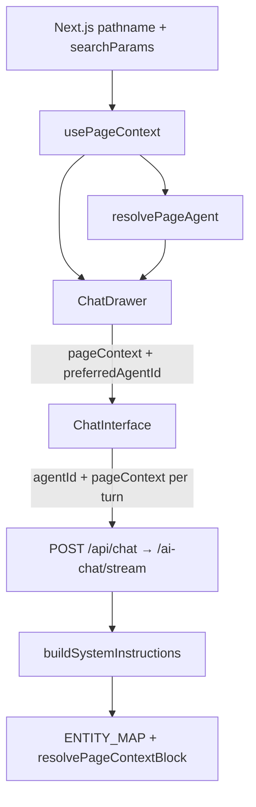

# 60 — Page-Aware Agent Context

**Status:** Implemented  
**Date:** 2026-08-30  
**Depends on:** `46_AGENTIC_AI_PLATFORM.md`, `57_CATALOGUE_CHAT_UX.md`, discussion `003-agentic-ui-mcp-apps-readiness.md`  
**Related:** capability packs (`catalog-ops`, `assessment-field`, `commercial-estimating`, `documents-workflow`)

---

## Overview

When the global chat drawer opens, the assistant should know **which page the user is on** and preferably load a **page-specialist agent** (tools, skills, system prompt) for that domain. Before this work, route-based page context only covered top-level app routes (`/jobs`, `/quotes`, …). Admin routes such as `/admin/catalog/...` sent pathname-only context, and chat always selected the tenant default agent (`claims-assistant`).

This document describes the implemented design and the checklist for wiring **additional pages** the same way.

---

## Goals

1. Derive rich `PageContext` from any route (app or admin), including nested IDs.
2. Send that context on every chat stream request so the API can enrich the system prompt.
3. Auto-select a page-default agent by **slug** when chat opens on a mapped page.
4. Keep user manual agent picks for the session; never force a page agent after the user switches.
5. Make the pattern additive so new pages need only map entries (and optional pack/agent), not new chat plumbing.

---

## Architecture



### Two context modes (unchanged)

| Mode | Trigger | What the model sees |
|------|---------|---------------------|
| **Global chat** | `AppShell` opens `ChatDrawer` without `initialContext` | Live `pageContext` on each stream + page-preferred agent when mapped |
| **AI Assist** | Form drawers pass `initialContext` | System message from `AIContextPayload`; **`pageContext` suppressed**; no page-agent preference |

---

## Data contracts

### Frontend + API `PageContext`

Shapes are mirrored in:

- `apps/frontend/src/lib/ai/use-page-context.ts`
- `apps/api/src/modules/ai-chat/ai-chat.types.ts`

```typescript
export interface PageContext {
  pathname: string;
  section?: 'admin' | 'app';
  entityType?: string;       // canonical type key used by API ENTITY_MAP + PAGE_AGENT_MAP
  entityId?: string;         // detail UUID (or nested resource UUID for admin item routes)
  jobId?: string;            // /jobs/[id] or ?jobId=
  pageLabel?: string;        // human label, e.g. "Catalogues Detail"
  adminArea?: string;        // e.g. "catalog", "agents" when section === "admin"
  parentEntityId?: string;   // e.g. catalogId when on /admin/catalog/[id]/items/[itemId]
}
```

### Stream body

`ChatInterface` sends (via `useChatStream` body function):

```json
{
  "messages": [],
  "conversationId": "uuid",
  "agentId": "agent-uuid-or-omitted",
  "pageContext": { "...PageContext" }
}
```

Proxied unchanged by `apps/frontend/src/app/(app)/api/chat/route.ts` → `POST /ai-chat/stream`.

---

## Layer 1 — Frontend route → `PageContext`

**File:** `apps/frontend/src/lib/ai/use-page-context.ts`

### Maps

- **`ROUTE_ENTITY_MAP`** — first URL segment for app routes (`jobs` → `job`, `quotes` → `quote`, …).
- **`ADMIN_ROUTE_MAP`** — second segment under `/admin/` (`catalog` → `catalog`, `agents` → `agent-config`, …).

### Parsing rules

| Path pattern | Result |
|--------------|--------|
| `/jobs` | `section: app`, `entityType: job`, list label |
| `/jobs/{uuid}` | `jobId` set; `entityId` omitted for jobs (job uses `jobId`) |
| `/tasks?jobId={uuid}` | `entityType: task` list + `jobId` from query |
| `/admin/catalog` | `section: admin`, `adminArea: catalog`, `entityType: catalog`, list |
| `/admin/catalog/{uuid}` | detail: `entityId` = catalog UUID |
| `/admin/catalog/{catalogId}/items/{itemId}` | `parentEntityId` = catalogId, `entityId` = itemId |
| `/admin/{unknown}` | `section: admin`, `adminArea` set, humanised label, no `entityType` |

UUID detection uses a standard UUID regex; only UUID segments count as entity IDs.

### How to add a new **app** page

1. Ensure the list/detail routes follow `/{plural}/` and `/{plural}/{uuid}`.
2. Add to `ROUTE_ENTITY_MAP`:

```typescript
vendors: { entityType: 'vendor', label: 'Vendors' },
```

3. Use a **singular, stable** `entityType` string that will match API `ENTITY_MAP` and (optionally) `PAGE_AGENT_MAP`.

### How to add a new **admin** page

1. Routes should live under `/admin/{area}/…`.
2. Add to `ADMIN_ROUTE_MAP`:

```typescript
skills: { entityType: 'skill', label: 'Skills' },
```

3. Nested resource rule (optional): if the path is `/admin/{area}/{parentUuid}/…/{childUuid}`, the hook already treats segment `[2]` as parent and `[4]` as child when both are UUIDs (catalogue items pattern). Extend the parser only if the path shape differs.

4. Unmapped admin areas still get `section` + `adminArea` + a label — enough for “Current Page” text, but no entity enrichment or page agent until mapped.

---

## Layer 2 — Page → default agent

**File:** `apps/frontend/src/lib/ai/use-page-agent.ts`

```typescript
const PAGE_AGENT_MAP: Record<string, string> = {
  catalog: 'catalog-assistant',
  assessment: 'assessment-assistant',
  quote: 'estimator',
  report: 'report-builder',
};

export function resolvePageAgentSlug(ctx: PageContext): string | undefined;
export function resolvePageAgent(ctx: PageContext, agents: Agent[]): Agent | undefined;
```

Lookup is by **agent slug** (from capability pack YAML / `agent.slug` in DB), not agent UUID. If the pack is not installed, the agent is missing from the list and chat falls back to tenant `isDefault`.

### How to add a page-default agent

1. Ship (or reuse) a chat agent with a stable `slug` in a capability pack, e.g. `apps/api/packs/.../agents/my-assistant.yaml`.
2. Ensure the pack is installed for the tenant so `listChatAgentsAction` returns that agent.
3. Add one line to `PAGE_AGENT_MAP`:

```typescript
vendor: 'vendor-assistant',
```

Key = `PageContext.entityType`. Value = agent `slug`.

### Wiring

**`ChatDrawer.tsx`**

- Computes `preferredAgentId` only when **not** in AI Assist mode (`!initialContext`).
- Uses `resolvePageAgent(pageContext, chatAgents)?.id`.
- Passes `preferredAgentId` to `ChatInterface`.

**`ChatInterface.tsx`**

- Prop: `preferredAgentId?: string`.
- `userPickedAgentRef` — set `true` when the user picks from the agent dropdown (`handleSelectAgent`).
- Selection effect:
  1. If current selection still valid in the agent pool → keep it.
  2. Else if user has not picked and `preferredAgentId` exists in pool → select it.
  3. Else → tenant `isDefault` or first agent.
- Sending `agentId: "default"` (sentinel) is still omitted so the API resolves the tenant default.

**Session behaviour:** remounting chat (`key={conversationId-sessionKey}`) resets selection; navigating while the drawer stays open updates `preferredAgentId`, but an already-valid selection is not overridden. Closing and reopening chat starts a new session.

---

## Layer 3 — API prompt enrichment

**Files:**

- `apps/api/src/modules/ai-chat/ai-chat.types.ts` — `PageContext` type (keep in sync with frontend).
- `apps/api/src/modules/ai-chat/page-context.ts` — `ENTITY_MAP` + `resolvePageContextBlock`.
- `apps/api/src/modules/ai-chat/ai-chat.service.ts` — appends context block in `buildSystemInstructions`; passes `pageContext.entityType` into skill matching.

### System prompt layers (order)

1. `agent.systemPrompt` (from DB / pack)
2. `## Current Context` from `resolvePageContextBlock`
3. `## Available Skills` when skills match
4. `## User Preferences` from user memory

### `ENTITY_MAP` entry shape

```typescript
interface PageEntityMapping {
  category: string;          // skill category boost (entityTypeToCategory)
  label: string;
  detailDocType?: string;    // DocumentGenerationService sample data key
  listDocType?: string;
  listHints: string[];       // "You can help the user:" bullets on list pages
  detailHints: string[];     // same for detail pages
}
```

### What `resolvePageContextBlock` does

1. If `jobId` → fetch `job_details` summary.
2. If `entityId` + mapping with `detailDocType` → fetch entity detail summary.
3. If list page + `listDocType` + tenantId → fetch list summary.
4. Always append `Current Page: {pageLabel}` (+ “filtered to active job” when `jobId`).
5. Append list/detail hints from the mapping.

Admin entries such as `catalog`, `agent-config`, `capability-pack`, `connection` currently provide **labels + hints only** (no `detailDocType` / `listDocType`). That is enough for action guidance; optional later work can add document mappers for live catalogue summaries.

### How to add API enrichment for a new page

1. Mirror any new `PageContext` fields in `ai-chat.types.ts` if you extend the contract.
2. Add `ENTITY_MAP[entityType]` with the same key as frontend `entityType`.
3. Write concrete `listHints` / `detailHints` that match real MCP tools and drawers (e.g. “Open the X form via `open_x`”).
4. Optionally add `detailDocType` / `listDocType` and register mappers in document generation if the model needs live field summaries.
5. Optionally add `CONTEXT_SUMMARY_FIELDS[docType]` for nicer detail formatting.

Skill matching already boosts skills whose category matches `entityType` → category; keep pack skill categories aligned with `ENTITY_MAP.category`.

---

## Layer 4 — Forms / tools from chat (existing pattern)

Page-aware context does **not** replace the canvas drawer pipeline. For chat-driven data entry on a page:

1. **MCP tools** (`open_*` / `fill_*` or create tools) in `apps/claims-mcp`.
2. **Backend** `CANVAS_TOOL_MAP` in `ai-chat.service.ts` → registry component name.
3. **Frontend** `drawer-registry.ts` + form accepts AI fill props.
4. **Capability pack** agent with `enabledTools` + `pinnedSkillSlugs` for that domain.

Catalogue example is documented in `57_CATALOGUE_CHAT_UX.md`. Assessment tabs follow the same open/fill pattern.

When the page-default agent is selected, its allowlist should include those tools so the model can open forms without switching agents.

---

## Checklist: enable page-aware chat for a new domain

Use this sequence for another agent implementing e.g. vendors, skills admin, or invoices.

### A. Route context

- [ ] Confirm URL shape (app vs admin).
- [ ] Add `ROUTE_ENTITY_MAP` or `ADMIN_ROUTE_MAP` entry with stable `entityType` + label.
- [ ] Verify nested UUID parsing (or extend parser if path ≠ catalogue items shape).
- [ ] Manually confirm chat request body includes expected `pageContext` on that route.

### B. Specialist agent (optional but recommended)

- [ ] Create/update pack agent YAML with unique `slug`, domain `systemPrompt`, `enabledTools`, `pinnedSkillSlugs`.
- [ ] Install pack / ensure agent appears in `listChatAgentsAction`.
- [ ] Add `PAGE_AGENT_MAP[entityType] = slug`.
- [ ] Open chat on the page → picker should show the specialist without manual select.

### C. Prompt hints + skills

- [ ] Add API `ENTITY_MAP` entry with list/detail hints.
- [ ] Align skill categories with `category` for page boost.
- [ ] (Optional) Document mapper + `detailDocType` / `listDocType` for live summaries.

### D. Chat forms (optional)

- [ ] MCP open/fill (or create) tools.
- [ ] `CANVAS_TOOL_MAP` + `drawer-registry` + AI fill props on the form.
- [ ] Agent tool allowlist includes those tools.

### E. Regression

- [ ] Unmapped pages still open chat with tenant default agent.
- [ ] AI Assist drawers still suppress `pageContext` and page-agent preference.
- [ ] Manual agent switch sticks for the conversation session.
- [ ] Job-scoped pages still pass `jobId` into context and canvas drawer props.

---

## Key files

| Area | Path |
|------|------|
| Frontend page context | `apps/frontend/src/lib/ai/use-page-context.ts` |
| Page → agent map | `apps/frontend/src/lib/ai/use-page-agent.ts` |
| Chat drawer wiring | `apps/frontend/src/components/chat/ChatDrawer.tsx` |
| Agent selection | `apps/frontend/src/components/chat/ChatInterface.tsx` |
| Stream proxy | `apps/frontend/src/app/(app)/api/chat/route.ts` |
| API PageContext type | `apps/api/src/modules/ai-chat/ai-chat.types.ts` |
| Context block builder | `apps/api/src/modules/ai-chat/page-context.ts` |
| Chat orchestration | `apps/api/src/modules/ai-chat/ai-chat.service.ts` |
| Drawer registry | `apps/frontend/src/lib/ai/drawer-registry.ts` |
| Example catalogue agent | `apps/api/packs/catalog-ops/agents/catalog-assistant.yaml` |
| Catalogue chat UX | `docs/implementation/57_CATALOGUE_CHAT_UX.md` |

---

## Current page ↔ agent mappings

| `entityType` | Route examples | Default agent slug |
|--------------|----------------|--------------------|
| `catalog` | `/admin/catalog`, `/admin/catalog/{id}` | `catalog-assistant` |
| `assessment` | `/assessments`, `/assessments/{id}` | `assessment-assistant` |
| `quote` | `/quotes`, `/quotes/{id}` | `estimator` |
| `report` | `/reports`, `/reports/{id}` | `report-builder` |
| *(other mapped entityTypes)* | app/admin routes | tenant `isDefault` (usually `claims-assistant`) |

Admin areas with context + hints but **no** page-agent map entry yet: `agent-config`, `capability-pack`, `connection` (and any unmapped `/admin/*` with label-only context).

---

## Non-goals / follow-ups

- **Admin-configurable page→agent** via DB column or UI — not implemented; slug map is code-owned for now.
- **Live catalogue (or other admin) detail fetch** via document mappers — hints only today.
- **Restore conversation’s stored `agentId` into the picker** when loading history — still not done.
- **True MCP Apps iframes** — still future; native drawers remain the form path (`003-agentic-ui-mcp-apps-readiness.md`).
- **Forcing page agent on every message after user override** — intentionally avoided.

---

## Example: catalogue page (reference implementation)

1. User navigates to `/admin/catalog/{catalogId}`.
2. `usePageContext` → `{ section: 'admin', adminArea: 'catalog', entityType: 'catalog', entityId, pageLabel: 'Catalogues Detail' }`.
3. `resolvePageAgent` → agent with slug `catalog-assistant` (if pack installed).
4. Chat opens with that agent selected; stream includes `pageContext`.
5. API appends `## Current Context` with catalogue detail hints (open/fill items, BOM, categories).
6. Agent tools can call `open_catalog_item` / `fill_catalog_item` → SSE `canvas-component` → `CatalogItemFormDrawer`.

Replicate that chain for any other page using the checklist above.
