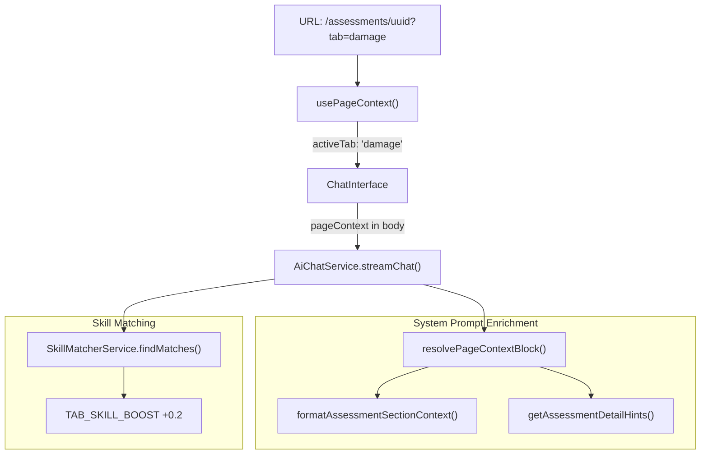

# 61 — Assessment Tab-Aware Chat Context

**Status:** Implemented
**Date:** 2026-08-30
**Depends on:** `60_PAGE_AWARE_AGENT_CONTEXT.md`
**Related:** capability pack `assessment-field`, `57_CATALOGUE_CHAT_UX.md`

---

## Overview

Extends the page-aware agent context system (doc 60) so the assessment chat differentiates between the **Assessments List** page and the **Assessment Detail** page with a specific active tab. The chat now provides:

- Tab-aware system prompt enrichment (active tab label + section completion status)
- Cross-section context summaries so the agent can reference completed tabs when filling the current one
- Per-tab skill boosting in the skill matcher
- Contextual suggested prompts in the chat empty state

---

## Goals

1. The chat system prompt knows **which assessment tab** the user is viewing.
2. The prompt includes a **section completion map** and **cross-tab summaries** from already-filled sections.
3. The **skill matcher** boosts the per-tab skill (e.g. `assessment-damage`) when viewing the corresponding tab.
4. Chat **suggested prompts** change based on list vs. detail page and the active tab.
5. The assessment agent system prompt instructs the model on **page-aware behaviour**: list page → full creation workflow; detail page → focus on the active tab.

---

## Architecture

Builds on the existing data flow from doc 60:



---

## Changes

### 1. `activeTab` in `PageContext`

**Frontend:** `apps/frontend/src/lib/ai/use-page-context.ts`
**API:** `apps/api/src/modules/ai-chat/ai-chat.types.ts`

Added `activeTab?: string` to the `PageContext` interface on both sides. On the frontend, extracted from `searchParams.get('tab')` when on an assessment detail page (has `entityType === 'assessment'` and `entityId`). Defaults to `'attendance'` when no `?tab=` param is present, matching `normaliseTab()` in `AssessmentDetailClient`.

Valid tab values: `attendance`, `building`, `habitability`, `hazards`, `damage`, `makeSafe`, `temporaryAccommodation`, `specialists`, `recommendation`.

### 2. Section completion map + cross-tab summaries

**File:** `apps/api/src/modules/ai-chat/page-context.ts`

When `entityType === 'assessment'` and on a detail page, the context block now includes:

- **Active Tab** label (e.g. "Active Tab: Damage & Cause")
- **Section Completion** status for all 9 tabs (empty / partial / complete), marking the current tab
- **Completed Section Summaries** with key field values from non-empty sections that are not the current tab

Example output appended to the system prompt:

```
Active Tab: Damage & Cause

Section Completion:
  - Attendance: complete
  - Building: complete
  - Habitability: empty
  - Hazards: partial
  - Damage & Cause: empty (current tab)
  - Make Safe: empty
  - Temp Accommodation: empty
  - Specialists: empty
  - Recommendation: empty

Completed Section Summaries:
  Attendance: Site visit: 12/05/2026, Attendees: John Smith, Builder/estimator: ABC Builders
  Building: Type: House, Construction: Brick Veneer, Roof: Tile, Design: Standard
```

Section status is derived from the assessment document mapper's flat field output, using `SECTION_SUMMARY_FIELDS` to check which key fields have values.

### 3. Dynamic assessment hints

**File:** `apps/api/src/modules/ai-chat/page-context.ts`

- **List page** hints updated to explicitly mention the full data-driven creation workflow (journals, photos, contacts, etc.) and the quick-start blank form option.
- **Detail page** hints are now computed dynamically based on `activeTab`, telling the model which specific tab section it should help fill.

### 4. Per-tab skill boost

**File:** `apps/api/src/modules/skills/skill-matcher.service.ts`

Added `TAB_SKILL_MAP` (mapping tab keys to skill slugs) and `TAB_SKILL_BOOST = 0.2`. After the existing `PAGE_CATEGORY_BOOST` (+0.3) is applied to all `category: 'assessments'` skills, an additional +0.2 is applied to the skill whose slug matches the active tab. This ensures the tab-specific skill ranks highest when the user is on that tab.

The `findMatches()` method now accepts an optional `activeTab` parameter, threaded from `pageContext.activeTab` via `AiChatService.matchSkillsForTurn()`.

### 5. Assessment agent system prompt

**File:** `apps/api/packs/assessment-field/agents/assessment-assistant.yaml`

Added a "Page-aware behaviour" block to the system prompt instructing the model to:

- On list page: follow the full data-driven creation path
- On detail page with active tab: focus on completing that tab, using section completion status and cross-references
- Use completed sections as evidence sources for the current tab
- On "complete all tabs": walk through only remaining empty/partial sections

### 6. Contextual suggested prompts

**Files:** `apps/frontend/src/components/chat/ChatMessageList.tsx`, `apps/frontend/src/components/chat/ChatInterface.tsx`

The chat empty state now shows context-aware suggestion chips:

| Page | Suggestions |
|------|-------------|
| Assessments List | "Create a new assessment for this job", "What assessments exist for this job?", "Open a blank assessment form" |
| Assessment Detail (e.g. Damage tab) | "Help me fill the Damage & Cause section", "Complete all remaining tabs", "Review journals for evidence", "Validate and publish this assessment" |
| Any other page | Default generic suggestions (unchanged) |

`pageContext` is threaded from `ChatInterface` → `ChatMessageList` via a new optional `pageContext` prop.

---

## Key files

| Area | Path |
|------|------|
| Frontend PageContext | `apps/frontend/src/lib/ai/use-page-context.ts` |
| API PageContext type | `apps/api/src/modules/ai-chat/ai-chat.types.ts` |
| Context block builder | `apps/api/src/modules/ai-chat/page-context.ts` |
| Skill matcher | `apps/api/src/modules/skills/skill-matcher.service.ts` |
| Chat orchestration | `apps/api/src/modules/ai-chat/ai-chat.service.ts` |
| Agent definition | `apps/api/packs/assessment-field/agents/assessment-assistant.yaml` |
| Chat message list | `apps/frontend/src/components/chat/ChatMessageList.tsx` |
| Chat interface | `apps/frontend/src/components/chat/ChatInterface.tsx` |

---

## Non-goals / follow-ups

- **Generic `activeTab` for all entity types** — only assessment needs tab context for now. Other tabbed entity types can adopt the same pattern by adding their own tab extraction in `usePageContext` and enrichment in `page-context.ts`.
- **Full JSONB section dump in system prompt** — only key field summaries are included. The agent fetches full section data via `get_assessment` when needed.
- **Auto-opening tab drawers on chat open** — the agent still requires a user message before taking action.
- **Tab context for admin pages** — admin routes like `/admin/catalog` could have tab-like sub-views; not addressed here.
