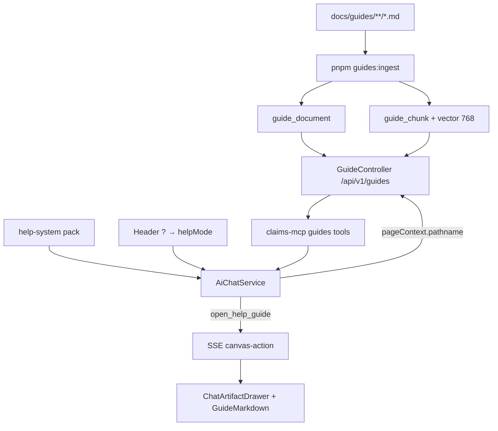

# 62 — Online Help System

**Status:** Partial — foundation shipped; content rollout ongoing  
**Date:** 2026-08-31  
**Depends on:** `46_AGENTIC_AI_PLATFORM.md`, `60_PAGE_AWARE_AGENT_CONTEXT.md`, discussion `003-agentic-ui-mcp-apps-readiness.md`  
**Related:** capability pack `help-system`, `57_CATALOGUE_CHAT_UX.md` (canvas pattern), `61_ASSESSMENT_TAB_AWARE_CHAT.md`, content rollout `63_HELP_GUIDE_CONTENT_ROLLOUT.md` (`63a`–`63j`)

---

## Overview

EnsureOS needs **in-product help** that mirrors the application menu (Operations + Configuration), is **discoverable from chat**, and opens as a **readable document beside chat** — not buried in a separate docs site.

This tranche delivers:

1. Markdown guides under `docs/guides/` with YAML frontmatter (routes, audience, tags).
2. Postgres storage (`guide_document` + `guide_chunk`) with **pgvector** embeddings for semantic search.
3. REST + MCP tools so agents can list, search, resolve by route, and open guides.
4. A **Help Assistant** capability pack and header **?** control that opens page-relevant help in the canvas.
5. A professional **markdown canvas renderer** (read-only for help guides).

**Source format decision:** Markdown remains the source of truth (authoring, Notion migration path, and clean embeddings). Presentation is upgraded in the frontend (`GuideMarkdown`); do **not** author guides as HTML.

---

## Goals

1. Users can press **?** on a page and get the matching guide opened in canvas with a short conversational summary.
2. Users can ask free-form help questions; the agent searches guides and cites/opens the best match.
3. Guide authors write plain Markdown with frontmatter; ingest is repeatable and idempotent (content hash).
4. Global (platform) guides are shared across tenants; tenant-specific overlays remain possible later.
5. Content inventory grows to cover the TOC in `docs/guides/index.md` without new chat plumbing per page.

---

## Non-goals (this tranche)

- Standalone Help Centre browse UI (optional later).
- Live Notion sync (ingest from exported Markdown / one-shot migration is enough initially).
- Audience-based ACL enforcement on guide rows (frontmatter `audience` is advisory for now).
- Interactive HTML / MCP App help panels (use `canvas-component` only if a specific interactive walkthrough is needed).

---

## Architecture



### Discovery paths

| Path | Mechanism |
|------|-----------|
| **Page help (?)** | `buildPageHelpMessage` + skill `help-with-current-page` → `get_guides_for_route(pathname)` → `open_help_guide` |
| **Prompt enrichment** | `AiChatService` appends “Available Help Guides” when `pageContext.pathname` matches `routes` |
| **Free-form Q&A** | Skill `search-help` → `search_help_guides` (vector) → answer + optional open |
| **Explicit open** | Skill `open-guide` / tool `open_help_guide` by slug |

### Canvas contract

`open_help_guide` tool result is converted to:

```ts
{
  type: 'canvas-action',
  action: 'open',
  artifactId: `guide_${slug}`,
  title: string,
  contentType: 'markdown',
  content: string, // full guide body (no frontmatter)
  version: 1,
}
```

Frontend treats `artifactId` starting with `guide_` as a **read-only help document** (no Edit/Save). Rendering uses `GuideMarkdown` (TOC, callouts, tables), not a raw textarea.

---

## Data model

### Migration

`apps/api/src/database/migrations-drizzle/0093_guide_documents.sql`

### `guide_document`

| Column | Notes |
|--------|--------|
| `tenant_id` | `NULL` = global/shared guide; tenant rows optional later |
| `slug` | Unique per tenant (including null-tenant uniqueness via partial/unique index practice) |
| `routes` | JSONB array of pathnames, e.g. `["/admin/roles","/admin/users"]` |
| `section` / `area` | Mirror menu: `operations` \| `configuration` + area key |
| `content` / `content_hash` | Body + SHA-256 of full file for skip-unchanged ingest |
| `related_guides` | JSONB slug list |
| `tags`, `audience`, `version`, `file_path` | Metadata |

### `guide_chunk`

Heading-aware chunks (~500 tokens), `heading_path`, `embedding_vec vector(768)` (Vertex `text-embedding-005`).

**Search:** cosine similarity; API filters below min similarity (~0.35); optional route boost when `route` query param is set.

**Tenant scope:** queries return tenant-owned **or** `tenant_id IS NULL` guides.

---

## Guide authoring contract

### Location

```
docs/guides/
  index.md                          # TOC only (not ingested — no slug)
  operations/
    index.md
    …guides…
  configuration/
    index.md
    organisation/roles-and-permissions.md   # shipped example
    …
```

Ignore `docs/Crunchwork/Guides/` as live help content — treat as **migration source** only until rewritten into `docs/guides/` with frontmatter.

### Frontmatter (required for ingest)

```yaml
---
title: "Roles & Permissions"
slug: roles-and-permissions          # required
description: "…"
section: configuration               # operations | configuration
area: organisation
routes:
  - /admin/roles
  - /admin/users
audience: manager                    # advisory: all | member | manager | admin
tags: [rbac, roles]
related_guides:
  - managing-users
version: 1
last_updated: 2026-08-31             # docs-only today (not persisted)
permissions_discussed:               # docs-only today
  - org.roles.read
---
```

**Ingest rules**

- Recursive `**/*.md`; skip files starting with `_`.
- Skip if missing `title` or `slug` (indexes intentionally skipped).
- Normalise CRLF → LF before parsing frontmatter (Windows-safe).
- Unchanged `content_hash` → skip.
- Optional `--tenant-id <uuid>`; default global (`NULL`).

### Markdown conventions for rendering

| Pattern | Canvas treatment |
|---------|------------------|
| `#` / `##` / `###` | Document title + section hierarchy; `##` feeds sticky TOC |
| `> **Note:**` / `**Warning:**` / `**Required permission:**` / `**Tip:**` | Coloured callout asides |
| GFM tables | Bordered, scrollable tables |
| `` `code` `` | Inline mono chips |

---

## API

**Module:** `apps/api/src/modules/guides/`  
**Auth:** JWT (`JwtAuthGuard`)  
**Base:** `/api/v1/guides`

| Method | Path | Purpose |
|--------|------|---------|
| `GET` | `/guides` | List documents (metadata) |
| `GET` | `/guides/search?q=&route=&topK=` | Vector search |
| `GET` | `/guides/by-route?route=` | Exact path → parent paths → title/slug hint |
| `GET` | `/guides/:slug` | Full document row |
| `GET` | `/guides/:slug/content` | `{ slug, title, content }` for canvas |

**Ingest CLI:** `pnpm --filter api guides:ingest` → `apps/api/scripts/ingest-guides.mts`

---

## MCP tools

**File:** `apps/claims-mcp/src/tools/guides.tool.ts`  
**Category / integration:** organisation → display name **Claims Organisation** (must match pack `integrationRefs`)

| Tool | Input | Behaviour |
|------|-------|-----------|
| `list_help_guides` | — | List guides |
| `search_help_guides` | `query`, optional `route`, `topK` | Semantic search |
| `get_guides_for_route` | `route` (pathname only, e.g. `/admin/roles`) | Route → guide metadata |
| `open_help_guide` | `slug` | Full markdown body for canvas |

---

## Capability pack

**Path:** `apps/api/packs/help-system/`

| Artifact | Role |
|----------|------|
| `pack.yaml` | Pack id `help-system`; integration **Claims Organisation** |
| `agents/help-assistant.yaml` | Slug `help-assistant` |
| `skills/help-with-current-page.yaml` | Page help flow |
| `skills/search-help.yaml` | Semantic Q&A |
| `skills/open-guide.yaml` | Open by slug/title |

**Install:** Capability Packs admin → install builtin `help-system`. Re-install after skill/agent YAML changes.

**Critical:** Integration display name must be exactly **Claims Organisation** (not `Organisation`).

---

## Frontend UX

| Piece | Path | Behaviour |
|-------|------|-----------|
| Header **?** | `AppHeader.tsx` | Far right (after notifications) |
| Help mode | `AppShell.tsx` / `ChatDrawer.tsx` | Prefer `help-assistant`; auto-send page-help message |
| Agent map | `use-page-agent.ts` | `role` / `user` → `help-assistant`; `buildPageHelpMessage` includes pathname |
| Page context | `use-page-context.ts` | Admin roles/users → entity types for maps |
| Canvas drawer | `ChatArtifactDrawer.tsx` | `guide_*` → read-only Help guide |
| Renderer | `GuideMarkdown.tsx` | Professional markdown document view |

---

## Implementation phases

### Phase A — Foundation (done)

- [x] `docs/guides/` TOC + folder skeleton  
- [x] First guide: `configuration/organisation/roles-and-permissions.md`  
- [x] Migration `0093_guide_documents`  
- [x] `GuideRepository` / `GuideService` / `GuideController` / `GuidesModule`  
- [x] Ingest CLI (`guides:ingest`) with CRLF-safe frontmatter + Vertex embeddings  
- [x] MCP guide tools + registration  
- [x] `help-system` pack (agent + 3 skills)  
- [x] Chat: route guide injection + `open_help_guide` → `canvas-action`  
- [x] Header **?** help mode + force preferred agent  
- [x] Route lookup hardening (parent paths + label hint; include global guides)  
- [x] `GuideMarkdown` professional renderer; guides read-only in canvas  
- [x] **?** placed right of notifications  

### Phase B — Content rollout (next)

Prioritise guides that unblock common support questions. Each guide needs frontmatter `routes` aligned to real pathnames.

**Detailed authoring plan:** [`63_HELP_GUIDE_CONTENT_ROLLOUT.md`](./63_HELP_GUIDE_CONTENT_ROLLOUT.md) and subplans `63a`–`63j` (coverage matrix, gold-standard contract, Crunchwork rewrite rules).

| Priority | Guide (slug) | Primary routes | Notes |
|----------|--------------|----------------|-------|
| P0 | `managing-users` | `/admin/users` | Complements roles guide |
| P0 | `getting-started` | `/`, `/dashboard` | Onboarding |
| P1 | `completing-an-assessment` | `/assessments`, `/assessments/[id]` | High traffic; tie to doc 61 |
| P1 | `creating-an-estimate` | `/quotes`, estimate detail | |
| P1 | `catalogues` | `/admin/catalog` | Align with catalogue assistant |
| P2 | Claims / jobs / invoices overviews | matching app routes | |
| P2 | Company settings, connections | admin routes | |
| P3 | Remainder of TOC in `docs/guides/index.md` | | |

**Process per guide**

1. Author Markdown + frontmatter under the correct folder.  
2. Link from section `index.md` + root TOC (already stubbed).  
3. `pnpm --filter api guides:ingest`.  
4. Smoke: `GET /guides/by-route?route=…` and **?** on that page.  

### Phase C — Crunchwork / Notion migration

1. Map `docs/Crunchwork/Guides/*.md` → target slugs under `docs/guides/operations/` (assessments, make-safe, works, variations).  
2. Rewrite into EnsureOS voice; add frontmatter `routes` / `tags` / `related_guides`.  
3. Do **not** ingest Crunchwork paths directly.  
4. Notion (later): export → Markdown → same frontmatter contract → ingest. Optionally add `source: notion` metadata later.

### Phase D — Coverage & page wiring

- Extend `PAGE_AGENT_MAP` / admin route maps only where a specialist agent is wrong; most pages should rely on **?** → Help Assistant + route match.  
- Ensure high-traffic pathnames appear in at least one guide’s `routes`.  
- Update `60_PAGE_AWARE_AGENT_CONTEXT.md` mapping table to include `role` / `user` → `help-assistant`.  

### Phase E — Hardening & optional product UI

| Item | Detail |
|------|--------|
| Unify ingest | Prefer calling Nest `GuideService.ingestGuide` from CLI (single chunk/embed path) |
| Persist `last_updated` | Column or rely on `updated_at` only |
| Embeddings CI check | Fail ingest loudly if Vertex unset in prod |
| Related guides UI | Links in `GuideMarkdown` footer from `related_guides` |
| FE API client | Optional `api.guides.*` for a future Help browser |
| Help browser page | `/help` or admin “Guides” list (optional) |
| Audience gating | Filter by role/claims when serving search/list |
| Pack seed | Auto-install `help-system` for new tenants (optional) |

---

## Ops checklist (per environment)

1. Apply migrations (includes `0093_guide_documents`).  
2. Configure Vertex project/location for embeddings.  
3. `pnpm --filter api guides:ingest`.  
4. Ensure Claims Organisation MCP integration is connected.  
5. Install capability pack `help-system`.  
6. Verify agent `help-assistant` appears in chat agent list.  
7. Smoke: `/admin/roles` → **?** → canvas opens Roles & Permissions rendered as markdown.

---

## Key files

| Area | Path |
|------|------|
| Guides content | `docs/guides/**` |
| Migration | `apps/api/src/database/migrations-drizzle/0093_guide_documents.sql` |
| Schema | `apps/api/src/database/schema/index.ts` (`guideDocument`, `guideChunk`) |
| Repository | `apps/api/src/database/repositories/guide.repository.ts` |
| Service / HTTP | `apps/api/src/modules/guides/*` |
| Ingest | `apps/api/scripts/ingest-guides.mts` |
| Chat integration | `apps/api/src/modules/ai-chat/ai-chat.service.ts` |
| MCP tools | `apps/claims-mcp/src/tools/guides.tool.ts` |
| Pack | `apps/api/packs/help-system/**` |
| Header / help mode | `AppHeader.tsx`, `AppShell.tsx`, `ChatDrawer.tsx` |
| Page help message | `apps/frontend/src/lib/ai/use-page-agent.ts` |
| Canvas UI | `ChatArtifactDrawer.tsx`, `GuideMarkdown.tsx` |

---

## Testing plan

### Automated / scripted

- [ ] Ingest dry run: unchanged files skipped; edited file re-chunks.  
- [ ] `GET /guides/by-route?route=/admin/roles` returns `roles-and-permissions`.  
- [ ] `GET /guides/by-route?route=Roles%20%26%20Permissions%20List` (label hint) still resolves.  
- [ ] `GET /guides/search?q=custom%20role` returns relevant chunks when embeddings configured.  
- [ ] `GET /guides/roles-and-permissions/content` returns markdown body without frontmatter.

### Manual product

- [ ] Pack install succeeds with Claims Organisation tools bound.  
- [ ] **?** on Roles & Permissions selects Help Assistant and auto-sends.  
- [ ] Canvas opens with rendered headings, tables, callouts (not raw MD).  
- [ ] Guide is read-only (no Edit/Save).  
- [ ] Free-form: “How do I create a custom role?” → search + useful answer; optionally opens guide.  
- [ ] **?** on a page with no guide → clear “no guide” message + search fallback.

---

## Risks & mitigations

| Risk | Mitigation |
|------|------------|
| Empty DB after deploy | Document ingest in deploy runbook; consider post-migrate ingest job |
| Agent passes page label instead of pathname | Skill + tool descriptions; `getGuidesByRoute` label fallback; help message includes pathname |
| Wrong MCP integration name | Pack must use **Claims Organisation** |
| Search useless without embeddings | Ingest warns; prod requires Vertex; route lookup still works without vectors |
| Stale guides after MD edits | Re-run `guides:ingest`; hash skip makes it cheap |

---

## Success criteria

1. On mapped pages with an ingested guide, **?** opens the correct guide in canvas within one tool round-trip.  
2. Guide reading experience is clearly “product help”, not a code editor.  
3. New guides require **only** Markdown + ingest — no API/MCP/pack code changes.  
4. TOC coverage grows until Operations + Configuration high-traffic screens each have at least one guide with accurate `routes`.
